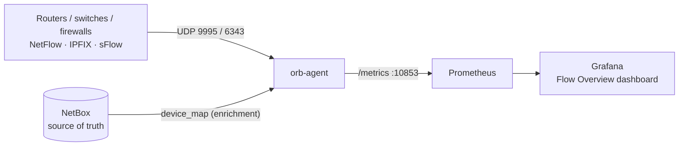
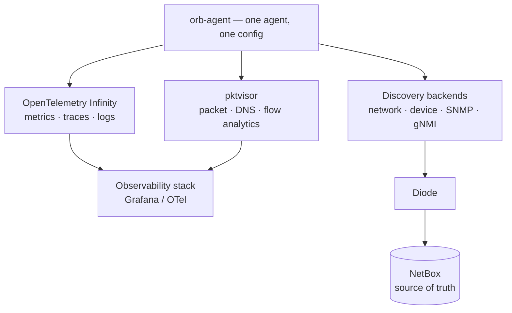

# Flow monitoring for Grafana with NetBox Labs orb-agent

Monitor **NetFlow v5/v9, IPFIX and sFlow** in Grafana using **orb-agent**. Includes
per-direction / packet / interface / ASN metrics and authoritative **NetBox**
device/interface enrichment.

## Overview

Network devices export flow records to orb-agent, which computes streaming summaries — top
talkers, ports, conversations, protocol mix, geo, ASN, interfaces, by bytes *and* packets —
and exposes them as Prometheus metrics for Grafana. Optionally it enriches each exporter and
interface with its real name from NetBox.



## Capabilities

| Dimension | Provided |
|---|---|
| NetFlow v5/v9, IPFIX, sFlow ingest | ✅ |
| Top talkers / ports / conversations | ✅ |
| Application (port → IANA service name) | ✅ |
| Protocol mix (TCP / UDP / other L4) | ✅ |
| GeoIP country / location | ✅ (GeoLite2) |
| Per-direction (in / out) counters | ✅ |
| Packets (not just bytes) | ✅ |
| Interfaces (in / out) | ✅ |
| ASN (autonomous system) | ✅ |
| NetBox device / interface enrichment | ✅ authoritative |

## More NetBox observability with orb-agent

Flow monitoring is just one of the things orb-agent does. It's NetBox Labs' single edge
agent for observability and discovery, driven by one policy model:

- **OpenTelemetry** — run managed OpenTelemetry pipelines (the OpenTelemetry Infinity
  backend) to collect and export metrics, traces and logs to your observability stack.
- **Deep network analytics** — packet, DNS and flow analysis (the pktvisor backend, the
  engine behind this flow integration) directly at the edge.
- **Network & device discovery** — network, device, SNMP and gNMI discovery backends that
  populate **NetBox** automatically via **Diode**, keeping your source of truth current.

One agent, one config — feeding both your observability stack (Grafana) and your source of
truth (NetBox).



## Before you begin

- Docker or Podman. Images are multi-arch (amd64 + arm64) — runs native on Apple Silicon.
- Grafana + Prometheus (self-hosted or Grafana Cloud).
- Devices able to export NetFlow/IPFIX (UDP 9995) or sFlow (UDP 6343).
- Optional: a **NetBox** instance + API token (enrichment); a GeoLite2-ASN/City `.mmdb`
  (ASN / geo).

## Install

Create `agent.yaml`:

```yaml
orb:
  config_manager:
    active: local
  backends:
    pktvisor:                 # orb-agent's flow / network-analytics backend
      host: 0.0.0.0
      port: "10853"
      geo_asn: /geo/GeoLite2-ASN.mmdb        # optional — enables ASN (mount the DB)
      taps:
        nf_tap:
          input_type: flow
          config: { flow_type: netflow, bind: 0.0.0.0, port: 9995 }   # sflow → port 6343
  policies:
    pktvisor:
      flow_policy:
        kind: collection
        input: { input_type: flow, tap: nf_tap }
        handlers:
          config: { deep_sample_rate: 100, num_periods: 5, topn_count: 10 }
          modules:
            flow_stats:
              type: flow
              config:
                enrichment: true                          # optional — device/interface names
                summarize_ips_by_asn: true                # optional — collapse external IPs to ASN
                exclude_unknown_asns_from_summarization: true
                device_map:                               # from NetBox (see Enrichment)
                  198.51.100.1:
                    name: edge-router-01
                    description: Edge router @ NYC
                    interfaces:
                      2: { name: xe-0/0/0, description: Uplink to core }
              metric_groups:
                enable: [counters, by_bytes, by_packets, cardinality, conversations,
                         top_ports, top_ips, top_ips_ports, top_interfaces, top_geo]
```

Run it:

```bash
docker run -d --name orb-agent \
  -v "$PWD/agent.yaml:/opt/orb/agent.yaml:ro" \
  -v "$PWD/geo:/geo:ro" \                 # only if using geo_asn
  -p 10853:10853 -p 9995:9995/udp \
  netboxlabs/orb-agent:latest run -c /opt/orb/agent.yaml
```

> `netboxlabs/orb-agent:latest` is multi-arch (amd64 + arm64) and runs natively on both,
> including Apple Silicon.

## Configure your exporters

Point devices at `<collector>:9995` (NetFlow/IPFIX) or `:6343` (sFlow). No hardware? On any
Linux host, `softflowd -i eth0 -n <collector>:9995 -v 10` exports real IPFIX. Confirm flows
are arriving with `flow_records_flows`.

## Send metrics to Grafana

**Recommended: push OTLP to Grafana Alloy.** orb-agent exports metrics over OTLP straight
into Grafana's own collector — no scrape endpoint to expose or firewall, and the same path
works self-hosted or to Grafana Cloud. Point orb-agent at Alloy:

```yaml
orb:
  backends:
    common:
      otlp:
        http: "http://<alloy-host>:4318"     # Alloy's OTLP/HTTP receiver
```

In Alloy, receive the OTLP and remote-write it to your Grafana store (Mimir, or Grafana
Cloud). Keep metric names suffix-free so dashboards bind unchanged:

```alloy
otelcol.receiver.otlp "in" {
  http { endpoint = "0.0.0.0:4318" }
  output { metrics = [otelcol.exporter.prometheus.to_store.input] }
}

otelcol.exporter.prometheus "to_store" {
  add_metric_suffixes = false          # keep flow_* names as pktvisor emits them
  forward_to = [prometheus.remote_write.store.receiver]
}

prometheus.remote_write "store" {
  endpoint { url = "http://<mimir-host>:9009/api/v1/push" }   # or your Grafana Cloud URL + token
}
```

For Grafana Cloud, swap the `url` for your Cloud remote-write endpoint and add a `basic_auth`
block — nothing upstream changes.

**Alternative: Prometheus scrape.** If you already run Prometheus, orb-agent also exposes all
policies' metrics on one endpoint:

```yaml
scrape_configs:
  - job_name: orb-agent
    metrics_path: /api/v1/policies/__all/metrics/prometheus
    static_configs:
      - targets: ["<collector-host>:10853"]
```

## NetBox enrichment (optional, recommended)

Turns raw exporter IPs into authoritative names (`edge-router-01 / xe-0/0/0`) sourced from
NetBox. Build the `device_map` from your NetBox inventory — map each exporter's primary IP to
its device name, and each interface's SNMP ifIndex to its interface name — then paste it
under `flow_stats.config` (keep `enrichment: true`) and restart orb-agent. Re-generate on a
schedule to keep it current as inventory changes. For ASN, mount a `GeoLite2-ASN.mmdb` and
set `geo_asn`.

## Import the dashboard

In Grafana, import the **Flow Overview** dashboard JSON and select your Prometheus
datasource. Panels: throughput (bytes + packets), protocol mix, top source IPs / dest ports /
conversations / interfaces — with enriched device/interface names.

## Metrics reference

- **Counters:** `flow_in/out_bytes`, `flow_in/out_packets`, split by TCP/UDP/other-L4 and
  IPv4/IPv6.
- **Cardinality:** `flow_cardinality_*` (src/dst IPs, ports, conversations).
- **Top-K (by bytes and packets):** `flow_top_*` — src/dst IPs (and IP+port), ports,
  conversations, interfaces, ASN, GeoIP location.
- **Volume seen:** `flow_records_flows`, `flow_records_filtered`.

Labels include `device`, `device_interface` (enriched from NetBox when enabled), `policy`, `tap`.

## Troubleshooting

- **No metrics:** they appear after the first full 60s window — wait ~90s.
- **Prometheus target down:** the scrape path must be `/api/v1/policies/__all/metrics/prometheus`.
- **`asn="Unknown"`:** mount a `GeoLite2-ASN.mmdb` and set `geo_asn`.
- **orb-agent crashes with `qemu-x86_64 … ld-linux`:** you're on an old image — pull a
  current `netboxlabs/orb-agent:latest` (multi-arch, native arm64).
- **Enrichment shows a raw IP:** the `device_map` key must equal the exporter's source IP;
  restart after editing.

## Uninstall

```bash
docker rm -f orb-agent
```

Stops collection; historical metrics remain in Prometheus per its retention.
